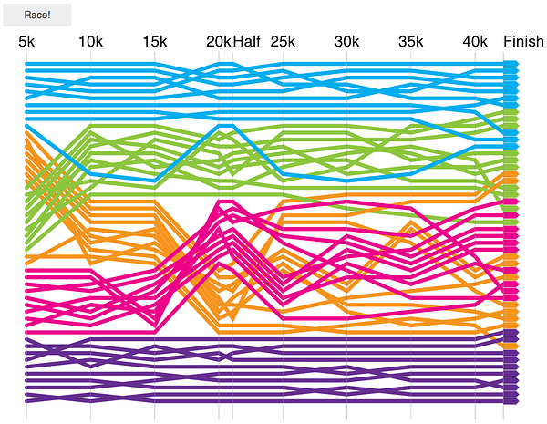

Kinetics of the Boston Marathon
===============================

Data visualization of the Boston Marathon. See [this blog post](http://www.drbunsen.org/kinetics-of-the-boston-marathon/) for details.



### Installation

* Dependencies:
  1. Python 2.7
  2. Node.js 0.10.26
  3. NPM 1.4.3

Assuming the dependencies above are installed, the following one-liner
will build the project. The viz should then be visible in the browser at `http://localhost:8000`.

```
$ make clean && npm install && make && cd dist && python -m SimpleHTTPServer
```
